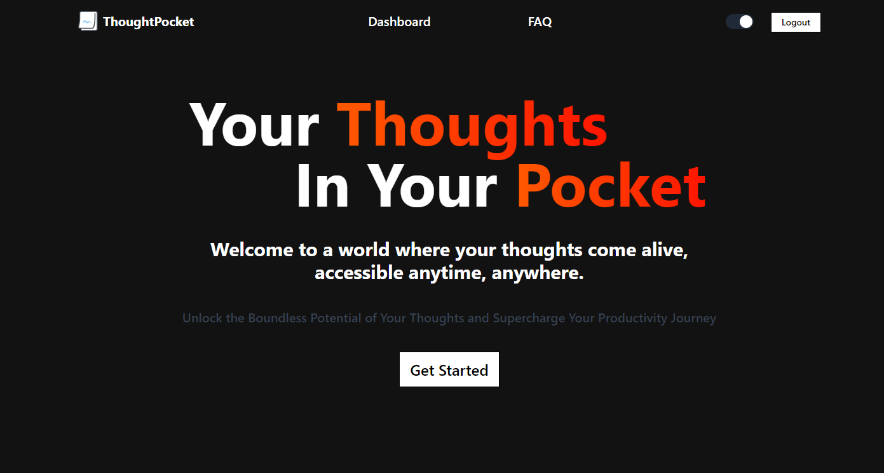

<h1>Thought Pocket</h1>

[Live](https://thought-pocket.kutaybekleric.com)

<h3>A fullstack note-taking app with WYSIWYG editor</h3>

# Introduction
This is my first _"real"_ fullstack app where I don't use Next.js's api routes. It is fully responsive and functional, but there are still some tweaks that can be made to make it better.

[Backend](https://github.com/kutaui/ThoughtPocket-Backend)

## Tech Stack

- Next.js
- Express.js
- MongoDB
- TailwindCSS
- shadcn/ui
- Typescript & Zod
- Redux

## Features

- <b>JWT Authentication</b>  

Express.js backend uses JWT to authenticate users. The token is stored in a httpOnly cookie and is valid for 30 days.

- <b>Full CRUD functionality on notes</b>  

Users can create, read, update and delete notes. The notes are stored in a MongoDB database.

- <b>Autosave notes and title</b> 

While this was not that hard to implement, it was a bit tricky to get it working with the WYSIWYG editor. Also, there are still some tweaking left to do in order to maximize UX.

- <b>Zod for input validation</b>  

Currently, I am using Zod only in the frontend. I am planning to use it in the backend as well.

### P.S. The backend is hosted on Render, so it might take time for the requests to go through for the first time.